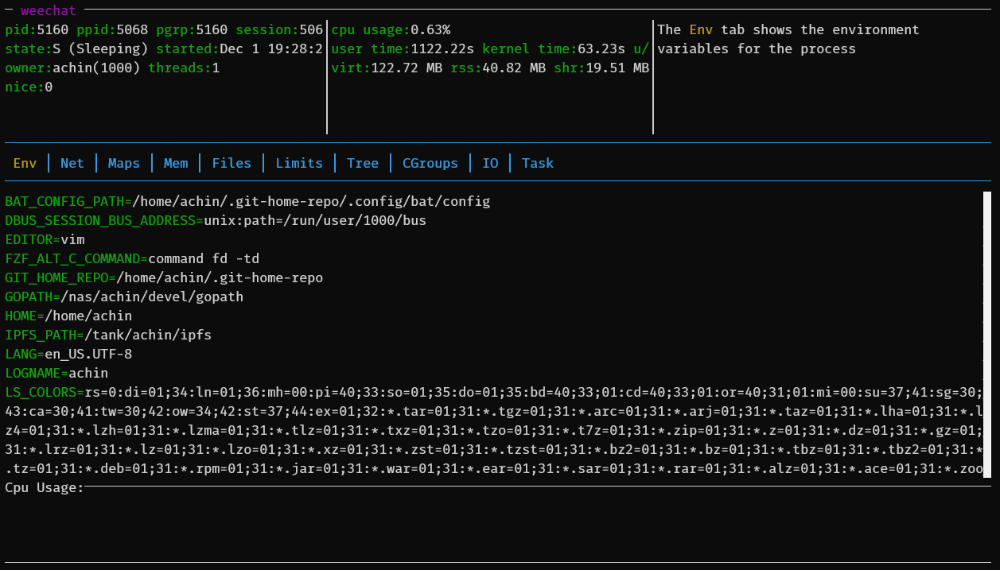

procdump
========

A linux command-line tool to display information about a running process

**Note** Under development, but please try it out and provide feedback



Procdump can show the following information about a given process:

* Environment variables
* Listening sockets and established network connections
* Memory mapped redions
* Memory usage information
* Open files
* Limits
* Cgroup info (only basic v1 cgroup info at the moment)
* IO information
* Task/Thread list

# Install

Install the latest version from git:

> cargo install --git https://github.com/eminence/procdump

Or clone and build from source.  Install [rust](https://rustup.rs/), download the source, and then run:

> cargo build

# Usage

```
procdump [PID]
```

If the `PID` argument is missing, procdump will show information
about its own running process.
